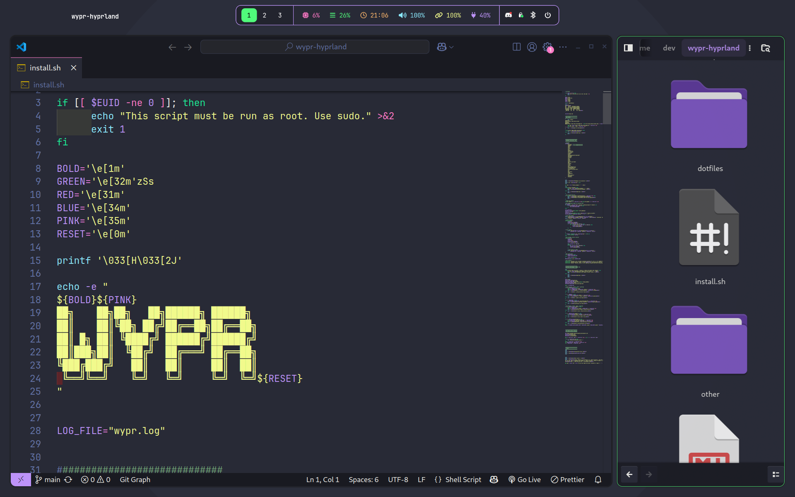
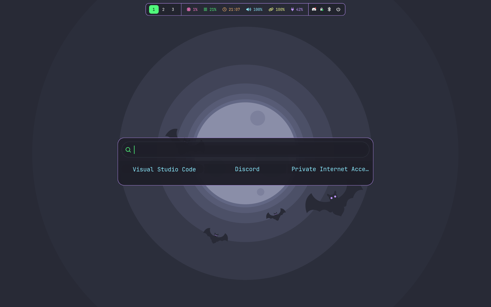

# wypr hyprland

My dotfiles for hyprland on Fedora - wypr

Dracula themed hyprland focusing more on legibility than aesthetics. Minimal transparency and blur. Dracula themed; gtk, waybar, wlogout, hyprlock, rofi, alacritty,starship prompt - also includes BetterDiscord Dracula theme. Built for my own quick setup on new machines (so also contains my template .bashrc and simple lazyvim nvim config).


### Images





> Installer Script

 

### Installation

```
git clone https://github.com/jameswylde/wypr.git
```
```
cd wypr
```
```
sudo bash install.sh
```

Post install run `hyprctl monitors` and note your display's name and amend in *~/.config/hypr/hyprland.conf* under *monitor* header, e.g *monitor=DP-1* - setting resolution, refresh rate and scale accordingly. Also, changing under *workspace* header to the same value. 

You can use *sed* to automate, for example `hyprctl monitors` returns *Virtual-1*, you can replace default *DP-1*:

```
sed -i 's/DP-1/Virtual-1/g' ~/.config/hypr/*
```


>❗
*This should get you a working out of the box config however changes in hyprland and other packages means that might not always be the case - hyprland.conf contains all relevant documentation links at the top of each section for configuration.*
